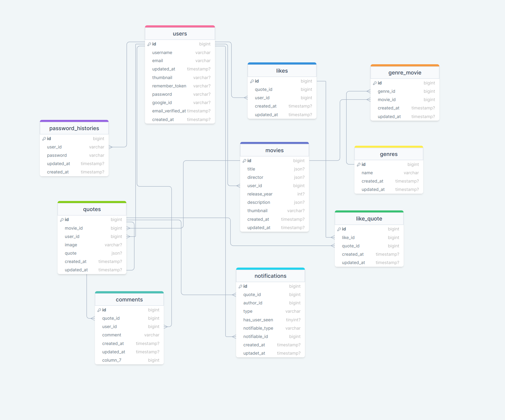

# Epic Movie Quotes

Epic Movie Quotes is a website where we may sign up, go through authorisation (and retrieve our passwords if we forget them), and search out quotes of movies, add movies. add quotes, comment and like them and also have our own profile page

## Table of Contents

-   [Prerequisites](#prerequisites)

-   [Tech Stack](#tech-stack)

-   [Getting Started](#getting-started)

-   [Migrations](#migration)

-   [Development](#development)

## Prerequisites

-   PHP@8.x and up
-   MYSQL@8 and up
-   npm@9.x and up
-   composer@2 and up

## Tech Stack

-   Laravel@10.6.2 - back-end framework
-   Spatie Translatable - package for translation
-   Tailwind3.3.1@up - front-end framework

## Getting Started

clone project from githun repository

```bash
  git https://github.com/RedberryInternship/levan-tchelishvili-epic-movie-quotes-back
```

Run composer install to install dependencies

```bash
  composer install
```

Install JS dependencies

```bash
  npm run dev
```

Now we need to set our env file. Go to the root of your project and execute this command.

```bash
cp .env.example .env
```

Update .env file

mysql

`DB_CONNECTION=mysql`

`DB_HOST=127.0.0.1`

`DB_PORT=3306`

`DB_DATABASE=*****`

`DB_USERNAME=*****`

`DB_PASSWORD=*****`

after setting up .enc run command

```bash
 php artisan key:generate
```

Which generates auth key.

#### Now, you should be good to go!

### Migration

if you've completed getting started section, then migrating database if fairly simple process, just execute:

```bash
php artisan migrate

php artisan db:seed '--class=GenreSeed'
```

### Development

You can run Laravel's built-in development server by executing:

```bash
php artisan serve
```

when working on JS you may run:

```bash
 npm run dev
```

it builds your js files into executable scripts. If you want to watch files during development, execute instead:

```bash
  npm run watch
```

it will watch JS files and on change it'll rebuild them, so you don't have to manually build them.


